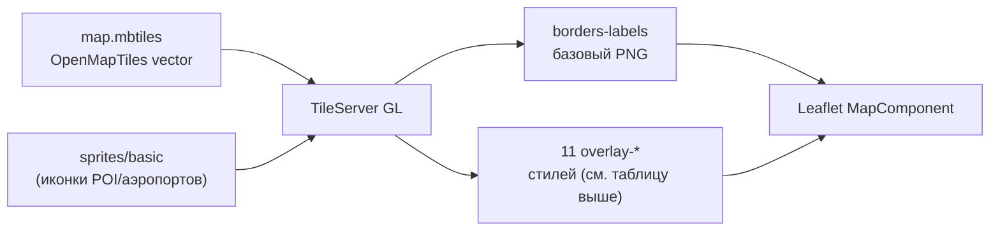

# Картографические слои: гидрография, транспорт, POI, рельеф

> Спецификация реализованного функционала переключаемых слоёв карты в InfoLake.
> Обновляйте документ при добавлении новых слоёв-оверлеев.

## Назначение

Пользователь может включать/выключать дополнительные слои поверх базовой карты. Цель текущего
набора — покрыть **все доступные в текущем `map.mbtiles` (OpenMapTiles) исходные слои**, которые
ещё не отрисованы в базовом стиле `borders-labels`, чтобы можно было оценить полезность каждого
на реальных данных перед тем, как включать что-то по умолчанию.

| Слой | ID | Стиль TileServer | Данные (OpenMapTiles) | Группа в панели |
|------|-----|------------------|-----------------------|-----------------|
| Водоёмы и реки | `water` | `overlay-water` | `water` (озёра, водохранилища), `waterway` (реки, каналы, ручьи) | Гидрография |
| Подписи гидрографии | `hydroLabels` | `overlay-hydro-labels` | `water_name` | Гидрография |
| Железные дороги | `railways` | `overlay-railways` | `transportation` class=rail/transit | Транспорт |
| Паромы и морские линии | `ferry` | `overlay-ferry` | `transportation` class=ferry | Транспорт |
| Названия дорог и улиц | `roadLabels` | `overlay-road-labels` | `transportation_name` | Транспорт |
| Аэродромы и ВПП | `aeroway` | `overlay-aeroway` | `aeroway` (ВПП, рулёжки, перрон), `aerodrome_label` | Аэродромы |
| Вершины и рельеф | `mountainPeaks` | `overlay-mountain-peaks` | `mountain_peak` (название, высота) | Рельеф |
| Районы, кварталы, острова | `districts` | `overlay-districts` | `place` class=suburb/quarter/neighbourhood/island/islet | Подписи |
| Номера домов | `houseNumbers` | `overlay-house-numbers` | `housenumber` | Подписи |
| Соц. инфраструктура (школы, больницы, полиция) | `poiInfrastructure` | `overlay-poi-infrastructure` | `poi` (медицина, охрана порядка, образование, религия) | Точки интереса |
| Транспортные объекты (вокзалы, АЗС, порты) | `poiTransport` | `overlay-poi-transport` | `poi` (аэропорты, вокзалы, паромные причалы, АЗС) | Точки интереса |
| Магазины, кафе, туризм | `poiServices` | `overlay-poi-services` | `poi` (еда, магазины, гостиницы, музеи, спорт, парки) | Точки интереса |

Регион не меняется — используется существующий `tileserver/data/map.mbtiles` (OpenMapTiles vector, planet, ~75 ГБ).

### Покрытие исходных слоёв OpenMapTiles

`GET /data/openmaptiles.json` для текущего `map.mbtiles` отдаёт 16 `vector_layers`. Статус использования:

| source-layer | Где используется |
|---------------|-------------------|
| `water`, `waterway` | база (`borders-labels`) + `overlay-water` |
| `water_name` | `overlay-hydro-labels` |
| `landcover`, `landuse`, `park` | база (`borders-labels`) |
| `boundary`, `place` | база (границы/подписи стран, городов) + `overlay-districts` (районы/кварталы/острова) |
| `transportation` | база (дороги) + `overlay-railways` + `overlay-ferry` |
| `transportation_name` | `overlay-road-labels` |
| `building` | база (контуры зданий) |
| `aeroway`, `aerodrome_label` | `overlay-aeroway` |
| `mountain_peak` | `overlay-mountain-peaks` |
| `housenumber` | `overlay-house-numbers` |
| `poi` | `overlay-poi-infrastructure` / `overlay-poi-transport` / `overlay-poi-services` |

Все 16 слоёв данных так или иначе задействованы — либо в базовой карте, либо в одном из оверлеев.

## Архитектура

Базовый стек не менялся: **Leaflet + растровые PNG** из TileServer GL. Каждый слой — отдельный
**прозрачный** стиль в TileServer, который рендерится как дополнительный `TileLayer` в Leaflet.



## Иконки (спрайты)

Слои `overlay-aeroway`, `overlay-mountain-peaks` и все `overlay-poi-*` используют растровый
спрайт `tileserver/sprites/basic/sprite.{json,png}` (набор иконок osm-bright, ~90 значков,
имена совпадают с полем `class` в OMT, напр. `hospital_11`, `restaurant_11`, `fuel_11`).

Подключение в `tileserver/config.json`:

```json
"options": { "paths": { "sprites": "sprites" } }
```

В стиле слоя: `"sprite": "basic/sprite"` → TileServer отдаёт его по адресу
`/styles/<style>/sprite[@2x].{json,png}`. Иконка выбирается выражением
`["concat", ["get", "class"], "_11"]` — работает «из коробки» для всех POI-классов, у которых
есть значок в спрайте (список см. `tileserver/sprites/basic/sprite.json`).

## Порядок слоёв (z-index)

Оверлеи — растровые `TileLayer` в `tilePane` (CSS z-index 200), поэтому всегда ниже
границ стран, зон действия (`overlayPane`, 400) и маркеров (`markerPane`, 600). Клики по объектам не перехватываются.

Prop `zIndex` упорядочивает оверлеи внутри `tilePane` (базовый тайл — default 1):

```text
base borders-labels        — 1
overlay-water               — 200
overlay-railways            — 210
overlay-ferry                — 220
overlay-aeroway              — 230
overlay-hydro-labels         — 250
overlay-road-labels          — 260
overlay-districts            — 270
overlay-mountain-peaks       — 280
overlay-house-numbers        — 290
overlay-poi-infrastructure   — 300
overlay-poi-transport        — 310
overlay-poi-services         — 320
```

## Файлы

### TileServer
- `tileserver/styles/overlay-water.json`, `overlay-hydro-labels.json`, `overlay-railways.json`, `overlay-ferry.json`
- `tileserver/styles/overlay-road-labels.json`, `overlay-aeroway.json`, `overlay-mountain-peaks.json`
- `tileserver/styles/overlay-districts.json`, `overlay-house-numbers.json`
- `tileserver/styles/overlay-poi-infrastructure.json`, `overlay-poi-transport.json`, `overlay-poi-services.json`
- `tileserver/sprites/basic/sprite.{json,png,@2x.json,@2x.png}` — иконки POI/аэропортов/вершин
- `tileserver/config.json` — регистрация стилей + `options.paths.sprites`

Все оверлеи имеют прозрачный фон:

```json
{ "id": "background", "type": "background", "paint": { "background-color": "rgba(0,0,0,0)" } }
```

### Frontend
- `frontend/src/config/tiles.js` — `MAP_OVERLAY_LAYERS`, `overlayTileUrl()`
- `frontend/src/hooks/useMapOverlayLayers.js` — состояние + persist в `localStorage` (`infolake.mapLayers.v1`)
- `frontend/src/components/MapComponent/MapOverlayLayers.jsx` — рендер активных `TileLayer`
- `frontend/src/components/MapComponent/MapLayerPanel.jsx` / `.css` — панель чекбоксов
- `frontend/src/components/MapComponent/MapComponent.jsx` — интеграция (секция «Слои карты» в fullscreen sidebar + рендер оверлеев после базового `TileLayer`)

## Проверка

TileServer (после `docker compose restart tileserver`):

```text
http://localhost:8080/styles/overlay-water/{z}/{x}/{y}.png
http://localhost:8080/styles/overlay-railways/{z}/{x}/{y}.png
http://localhost:8080/styles/overlay-ferry/{z}/{x}/{y}.png
http://localhost:8080/styles/overlay-hydro-labels/{z}/{x}/{y}.png
http://localhost:8080/styles/overlay-road-labels/{z}/{x}/{y}.png
http://localhost:8080/styles/overlay-aeroway/{z}/{x}/{y}.png
http://localhost:8080/styles/overlay-mountain-peaks/{z}/{x}/{y}.png
http://localhost:8080/styles/overlay-districts/{z}/{x}/{y}.png
http://localhost:8080/styles/overlay-house-numbers/{z}/{x}/{y}.png
http://localhost:8080/styles/overlay-poi-infrastructure/{z}/{x}/{y}.png
http://localhost:8080/styles/overlay-poi-transport/{z}/{x}/{y}.png
http://localhost:8080/styles/overlay-poi-services/{z}/{x}/{y}.png
```

Быстрая визуальная проверка (без Leaflet) — static-endpoint TileServer:

```text
http://localhost:8080/styles/overlay-aeroway/static/37.4146,55.9726,12/600x600.png       (Шереметьево)
http://localhost:8080/styles/overlay-mountain-peaks/static/42.4453,43.3499,10/600x600.png (Эльбрус)
```

UI: fullscreen карты → sidebar (☰) → секция «Слои карты» → чекбоксы, сгруппированные по темам
(«Гидрография», «Транспорт», «Аэродромы», «Рельеф», «Подписи», «Точки интереса»).
Состояние сохраняется после перезагрузки.

**Минзумы POI/подписей** (чтобы не перегружать карту на мелком масштабе): иконки POI — с z12–13,
подписи названий POI — с z15–16, номера домов — с z17, названия дорог — с z11.

## Оффлайн

Новые JSON-стили коммитятся в git и попадают в оффлайн-поставку автоматически.
`map.mbtiles` переносится отдельно (как и раньше). Все слои работают через локальный TileServer `:8080` без интернета.

## Выделение дорог и железных дорог

Чтобы автомобильные и железные дороги «читались» на карте:

- **Автодороги** (в базовом стиле [`borders-labels.json`](tileserver/styles/borders-labels.json)) —
  усилены цвета и толщины с чётким классификационным контрастом: магистрали (`motorway`) — насыщенный
  оранжевый `#ff8a33` с тёмной обводкой, `trunk/primary` — `#ffb84d`, `secondary/tertiary` — жёлтый
  `#ffe082`, `minor/service` — белый с серой обводкой. Появляются раньше (motorway с z4) и растут по
  ширине до z20 (стопы `..., 16, 9, 20, 15` и т.п.).
- **Железные дороги** (оверлей [`overlay-railways.json`](tileserver/styles/overlay-railways.json)) —
  классический топознак: сплошная тёмная линия `#2f2f2f` + белые «шпалы» (`line-dasharray`) поверх.
  Видны с z5, ширина растёт до z20. Слой включён **по умолчанию** (`defaultOn: true` в
  [`tiles.js`](frontend/src/config/tiles.js)), чтобы ж/д сеть была видна сразу.

## Отображение на крупном масштабе (overzoom)

Исходные векторные данные OpenMapTiles имеют `maxzoom: 14`. TileServer GL (mbgl-native) умеет
**overzoom** — рендерить растровый тайл на более глубоком zoom, дотягивая геометрию из тайла z14.
Проверено эмпирически (см. тест `curl`): базовый стиль и все оверлеи корректно и быстро (<150 мс)
отдают валидный PNG вплоть до z20 включительно, без ошибок TileServer.

Поэтому `maxZoom` карты (`MapContainer`), базового `TileLayer` и всех оверлеев в
[MapComponent.jsx](frontend/src/components/MapComponent/MapComponent.jsx)
и [MapOverlayLayers.jsx](frontend/src/components/MapComponent/MapOverlayLayers.jsx) увеличен до `19`.
Ключевые линейные слои (дороги, ж/д, вода, паромы, ВПП) имеют стопы ширины вплоть до z20, поэтому
на крупном масштабе они не «худеют», а остаются чёткими и заметными (сервер рендерит заново на
каждом zoom, без блюра от растяжения пикселей).

**Важно:** на глубоком zoom конкретный маленький тайл может быть пустым — это ожидаемо (в этой
области физически нет объекта слоя, например узкая ж/д ветка). TileServer может писать
безобидные `WARNING`-логи вида `Provided camera options returned 2 tiles...` — это диагностика
внутреннего рендера, не ошибка.

## Дальнейшее развитие (не реализовано)

Все 16 `vector_layers`, присутствующих в текущем `map.mbtiles`, теперь задействованы (см. таблицу
покрытия выше). Дальнейшее расширение требует **новых источников данных**, а не просто новых стилей:

| Слой | Источник | Реализация |
|------|----------|------------|
| Линии электропередач | `power` в OMT (нет в текущих тайлах) | требует пересборки MBTiles с этим слоем |
| Рельеф (hillshade, отмывка высот) | DEM → raster MBTiles | отдельный источник + стиль (не векторные данные OMT) |
| Морские торговые пути | нет в OSM | пользовательский GeoJSON-слой |
| Изолинии высот (contour) | DEM | отдельный источник (аналогично hillshade) |

### Возможные доработки существующих слоёв (без новых данных)

| Идея | Описание |
|------|----------|
| Разделение вода/реки | Сейчас в одном чекбоксе `water`; можно разбить на `water` (озёра/водохранилища) и `waterway` (реки/каналы) отдельными переключателями |
| Более гранулярные POI-группы | Сейчас 3 группы (инфраструктура/транспорт/сервис); при необходимости можно дробить дальше (например «Финансы» отдельно от «Образование») |
| Иконки для военных/спецклассов POI | В спрайте `basic` нет иконок для части классов (напр. `parking`, `atm`, `clinic`) — при необходимости точки этих классов рендерятся без иконки (используются в `overlay-poi-*` только классы, для которых иконка **есть**) |
