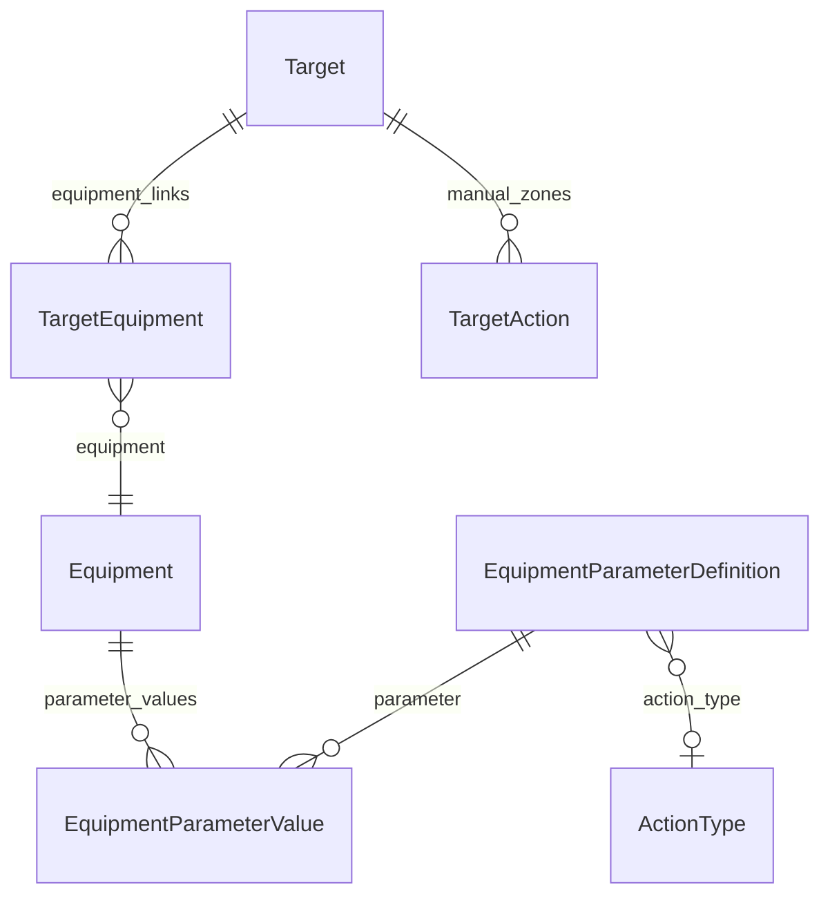

# Каталог техники и зоны дальности на карте

**Ветка:** `develop-weaponlist`  
**Статус:** MVP backend + карта + админка + **фаза 2 (UI + API write)** — **готово**  
**Django app:** `equipment` — каталог ТТХ (таблицы `formular_*` через `db_table`)

## Задачи

- [x] **models-catalog** — `Equipment`, категории, параметры, значения ТТХ
- [x] **migration-admin** — app `equipment`, unfold-админка, autocomplete
- [x] **target-equipment** — M2M `Target.equipment` через `TargetEquipment` + поле `quantity`
- [x] **api-zones** — `deployed_equipment[]` в `TargetSerializer`, endpoints каталога
- [x] **frontend-zones** — `buildVisibleZones.js` объединяет `actions[]` + зоны из каталога
- [x] **seed-demo** — `python manage.py seed_equipment_demo` (12 образцов, 6 площадок)
- [x] **frontend-ui** — выбор техники и количества в EditTargetModal; ТТХ в FormularModal
- [x] **api-write** — PATCH/POST Target с `deployed_equipment`

---

## Фактическая архитектура (упрощённая)

Отдельные модели **`TargetEquipmentZone`** и переопределение радиуса на площадке **не используются**.  
Зоны на карте читаются **только из каталога** (`EquipmentParameterValue` + `parameter.action_type`).

| Сущность | Роль |
|----------|------|
| **Equipment** | Образец в каталоге (Су-35С, Т-90М, С-400) |
| **EquipmentCategory** | Дерево: ВВС, танки, БМП, ЗРК, … |
| **EquipmentParameterDefinition** | Шаблон ТТХ; FK `action_type` → тип зоны на карте |
| **EquipmentParameterValue** | Число (`value` FloatField) у образца |
| **Target** | Площадка на карте |
| **TargetEquipment** | Through-модель: объект + образец + **quantity** |



**Правило зоны:** `parameter.action_type IS NOT NULL` и `value > 0` (км) → круг на карте с центром в `Target.lat/lng`.  
`quantity` — справочно (в API и админке); **не дублирует** круги на карте.

---

## Каталог

- Параметры только **float** (`EquipmentParameterValue.value`), без `data_type`
- Типы зон для авиации: практическая / перегоночная дальность, боевой радиус
- Для наземной техники: дальность стрельбы, радиус действия
- Для ЗРК: зона поражения, радиус действия
- Валидация: `action_type` только при единице «км»

---

## Размещение на Target

```python
# formular/models.py
class TargetEquipment(models.Model):
    target = FK → Target  # related_name='equipment_links'
    equipment = FK → Equipment
    quantity = PositiveIntegerField(default=1, min=1)

# Target.equipment — M2M through='TargetEquipment'
```

**Админка:** вкладка «Вооружение и техника» (`TargetEquipmentInlineAdmin`, unfold `tab=True`).

---

## API

| Endpoint | Назначение |
|----------|------------|
| `GET /api/v1/equipment-categories/` | Категории техники |
| `GET /api/v1/equipment-parameters/?maps_to_zone=true` | Параметры с типом зоны |
| `GET/POST/PUT/PATCH/DELETE /api/v1/equipment/` | Каталог образцов + `parameter_values[]` |

**Фрагмент `TargetSerializer` (detail):**

```json
"deployed_equipment": [
  {
    "equipment": { "id": 1, "designation": "Су-35С", "title": "..." },
    "quantity": 12,
    "specs": [{ "title": "Практическая дальность полёта", "value": 3600, "unit": "км" }],
    "zones": [
      {
        "parameter_title": "Практическая дальность полёта",
        "action_type": { "title": "Практическая дальность", "color": "#2ecc71", "line_type": "solid" },
        "radius_km": 3600
      }
    ]
  }
]
```

**Запись (POST/PUT/PATCH):**

```json
"deployed_equipment": [{ "equipment_id": 1, "quantity": 12 }]
```

Список (`TargetListSerializer`) отдаёт `deployed_equipment` без `specs`.

Зоны: `equipment.catalog_zone_values()` — без `is_enabled` / override на площадке.

---

## Frontend (сделано / план)

| Сделано | План (фаза 2) |
|---------|----------------|
| `buildVisibleZones.js` — merge `actions` + `deployed_equipment[].zones` | ~~UI выбора техники в EditTargetModal~~ |
| `ActionZonesLayer` — ключ зоны по `equipment.id` | ~~Отображение quantity и ТТХ в FormularModal~~ |
| Фильтр зон по `action_type.title` | ~~Запись `deployed_equipment` через API~~ |
| `EditTargetModal` — вкладка «Вооружение и техника» | |
| `FormularModal` — блок ТТХ и зон | |
| `TargetEquipmentEditor`, `DeployedEquipmentDisplay` | |

---

## Seed и проверка

```bash
docker compose exec backend python manage.py seed_equipment_demo
```

Демо-объекты: `label` начинается с `seed:equipment:` (Борисоглебск, Энгельс, база танков, …).

---

## Миграции (хронология)

| Миграция | Содержание |
|----------|------------|
| `formular/0036` | Первичный каталог (позже перенесён) |
| `formular/0037` + `equipment/0001` | State-only: app `equipment`, `db_table=formular_*` |
| `equipment/0002` | Только float; удалены deployment zones |
| `formular/0038` | M2M `Target.equipment` |
| `equipment/0003` | Удалена старая модель `TargetEquipment` из equipment |
| `formular/0039` | Явная through `TargetEquipment` + `quantity` |

---

## Следующие шаги для агента

1. Ручная проверка: EditTargetModal → вкладка «Вооружение и техника» → сохранение → зоны на карте.
2. При расширении каталога — пагинация `/equipment/` или поиск в селекторе.
3. **Документация:** при изменении контракта обновлять `project_context.md` §5–§7.

## Риски

- Много кругов на одной точке — различаются `ActionType.color` / `line_type`.
- `TargetAction` и зоны техники **оба активны** — фильтр по стране + типу действия общий.
- Оффлайн: образы Docker + `collectstatic` (unfold); wheels в `offline/python-wheels/` при необходимости.
