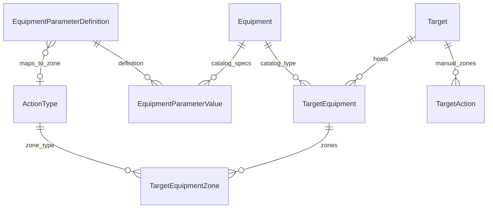
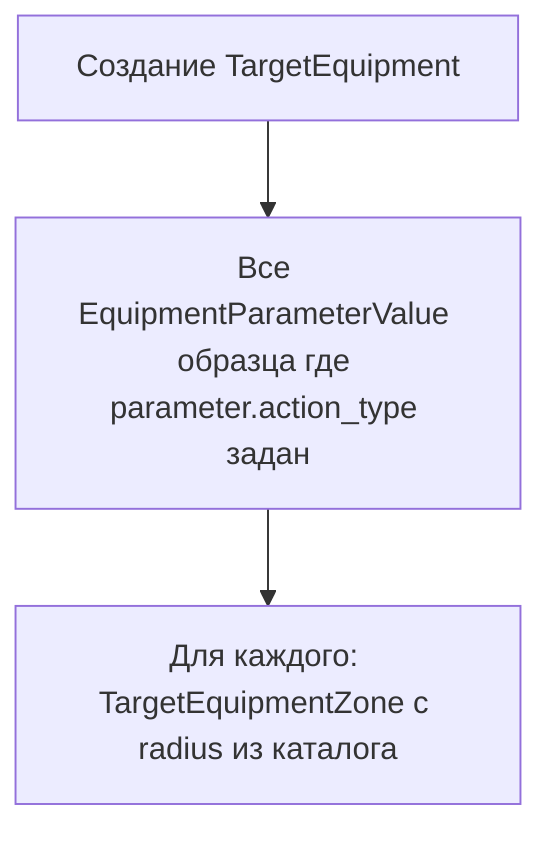

# Модель вооружения: несколько зон дальности на тип техники

**Ветка:** `develop-weaponlist`  
**Статус:** план (не реализовано)

Каталог техники с несколькими показателями дальности (каждый → свой `ActionType` / зона на карте) + размещение на `Target` (аэродром). При привязке техники к площадке зоны копируются из ТТХ каталога с возможностью переопределения по каждому показателю.

## Задачи

- [ ] **models-catalog** — Каталог: `EquipmentCategory`, `UnitOfMeasure`, `EquipmentParameterDefinition` (много zone-параметров с `action_type`), `Equipment`, `EquipmentParameterValue`
- [ ] **models-deployment** — `TargetEquipment` (состав площадки) + `TargetEquipmentZone` (несколько зон на каждую запись: parameter, action_type, radius_km, is_enabled)
- [ ] **migration-admin** — Миграция 0036, admin/inlines (ТТХ образца + зоны на TargetEquipment), валидация км/float для zone-параметров
- [ ] **sync-zones-from-catalog** — При создании `TargetEquipment` — создать `TargetEquipmentZone` из всех каталоговых параметров с `action_type`; сервис переопределения radius
- [ ] **api-zones** — API: equipment + `deployed_equipment[].zones[]`; карта: `TargetAction` + все enabled `TargetEquipmentZone`
- [ ] **seed-demo** — seed: Су-35 с 3 дальностями (3600/4500/1500 км) на аэродроме
- [ ] **frontend-later** — Фаза 2: UI состава площадки и чекбоксы/редактирование зон по каждому показателю

---

## Доменная модель

| Сущность | Роль |
|----------|------|
| **Target** | Площадка на карте (аэродром, база) |
| **Equipment** | Образец в каталоге (Су-35С, Т-90) |
| **EquipmentParameterDefinition** | Шаблон показателя ТТХ; **несколько** могут быть привязаны к `ActionType` |
| **EquipmentParameterValue** | Значение показателя у образца (3600 км, 4500 км, …) |
| **TargetEquipment** | «На этом аэродроме есть N единиц Су-35С» |
| **TargetEquipmentZone** | **Одна зона** для этой техники на площадке (практическая дальность, перегоночная, боевой радиус, …) |



---

## Часть 1. Гибкий каталог: несколько зон на тип техники

Паттерн EAV: **один образец — много параметров**; любое число параметров может стать зоной на карте.

### Справочники

| Модель | Поля |
|--------|------|
| **EquipmentCategory** | `title`, `parent`, `order` |
| **UnitOfMeasure** | `title`, `symbol` |
| **EquipmentParameterDefinition** | `title`, `code`, `data_type`, `unit`, M2M `categories`, `order`, **`action_type`** (FK, null=True), `help_text` |
| **Equipment** | `title`, `designation`, `category`, `origin_country`, `description` |
| **EquipmentParameterValue** | `equipment`, `parameter`, `value_float` / `value_int` / … |

**Правило зоны в каталоге:** если у `EquipmentParameterDefinition` заполнен `action_type` и тип `float` + единица «км» — значение в каталоге задаёт **радиус круга** этого типа зоны.

Не нужен отдельный флаг `is_zone_radius_source` — достаточно `action_type IS NOT NULL`.

### Пример: Су-35С в каталоге

| Параметр (definition) | Значение | ActionType (зона на карте) |
|-----------------------|----------|----------------------------|
| Практическая дальность полёта | 3600 км | «Практическая дальность» |
| Перегоночная дальность | 4500 км | «Перегоночная дальность» |
| Боевой радиус действия | 1500 км | «Боевой радиус» |
| Макс. скорость | 2400 км/ч | — (без `action_type`, только справочно) |

В админке для категории «Истребители» заводятся все нужные definitions; для Су-35 заполняются values. **Добавление нового типа зоны** = новая строка в справочнике параметров + новый `ActionType` — без миграции схемы.

```python
# EquipmentParameterDefinition — ключевое поле
action_type = models.ForeignKey(
    ActionType,
    on_delete=models.SET_NULL,
    null=True,
    blank=True,
    verbose_name='Тип зоны действия',
    help_text='Если задано, числовое значение (км) отображается как зона на карте',
)
```

Валидация `clean()`:

- `action_type` только при `data_type=float` и `unit=км`
- `action_type` уникален в рамках одной категории (опционально) или глобально — на усмотрение

---

## Часть 2. Размещение на Target

### TargetEquipment (состав площадки)

```python
class TargetEquipment(models.Model):
    target = models.ForeignKey(Target, related_name='deployed_equipment', ...)
    equipment = models.ForeignKey(Equipment, related_name='deployments', ...)
    quantity = models.PositiveIntegerField(default=1, blank=True)
    notes = models.CharField(max_length=250, blank=True)
    # БЕЗ единственного action_radius_km — зоны вынесены в дочернюю модель
```

### TargetEquipmentZone (несколько зон на каждую единицу техники)

```python
class TargetEquipmentZone(models.Model):
    target_equipment = models.ForeignKey(
        TargetEquipment, related_name='zones', on_delete=models.CASCADE,
    )
    parameter = models.ForeignKey(
        EquipmentParameterDefinition,
        on_delete=models.SET_NULL,
        null=True, blank=True,
        help_text='Какой показатель ТТХ задаёт эту зону',
    )
    action_type = models.ForeignKey(ActionType, on_delete=models.SET_NULL, null=True)
    radius_km = models.FloatField(null=True, blank=True)
    is_enabled = models.BooleanField(
        default=True,
        help_text='Снять галочку — зона не рисуется на карте',
    )

    class Meta:
        unique_together = [('target_equipment', 'parameter')]
        # или unique_together по action_type — одна зона каждого типа на запись техники
```

**Автозаполнение при создании `TargetEquipment`:**



- Оператор может **изменить `radius_km`** или **отключить** зону (`is_enabled=False`) для конкретной площадки.
- Можно **добавить зону вручную**, если в каталоге появился новый параметр позже (кнопка «Синхронизировать зоны из ТТХ»).

---

## Часть 3. Отображение на карте

**Два источника кругов** (все с центром в `Target.lat/lng`):

| Источник | Описание |
|----------|----------|
| `TargetAction` | Ручные зоны объекта (как сейчас) |
| `TargetEquipmentZone` | Зоны техники на площадке (`is_enabled` + `radius_km` + `action_type`) |

Для одного аэродрома с 12× Су-35С — **один набор зон** на запись `TargetEquipment` (не 12 дублирующих кругов на каждый самолёт). `quantity` — справочно в формуляре.

**API** ([`backend/api/serializers.py`](backend/api/serializers.py)):

```json
{
  "title": "Аэродром X",
  "lat": 51.35,
  "lng": 42.08,
  "actions": [ ... ],
  "deployed_equipment": [
    {
      "id": 1,
      "equipment": { "id": 5, "title": "Су-35С" },
      "quantity": 12,
      "zones": [
        {
          "parameter_title": "Практическая дальность полёта",
          "action_type": { "title": "Практическая дальность", "color": "#...", "line_type": "solid" },
          "radius_km": 3600,
          "is_enabled": true
        },
        {
          "parameter_title": "Перегоночная дальность",
          "action_type": { "title": "Перегоночная дальность", "color": "#...", "line_type": "dashed" },
          "radius_km": 4500,
          "is_enabled": true
        },
        {
          "parameter_title": "Боевой радиус действия",
          "action_type": { "title": "Боевой радиус", "color": "#...", "line_type": "solid" },
          "radius_km": 1500,
          "is_enabled": false
        }
      ]
    }
  ]
}
```

**Frontend:** расширить [`frontend/src/utils/buildVisibleZones.js`](frontend/src/utils/buildVisibleZones.js) — для каждого Target собрать зоны из `deployed_equipment[].zones[]` (enabled + radius) + `actions[]`. Цвет/тип линии из `action_type` (как сейчас).

**Фильтр зон на карте** (`actionZoneFilters`): ключ — `country` + `action_type.title`; новые типы («Перегоночная дальность») появятся в панели автоматически при наличии данных.

---

## Часть 4. Admin и API

### Admin

- **EquipmentParameterDefinition** — список с колонкой «Тип зоны» (`action_type`)
- **Equipment** — inline **EquipmentParameterValue** (все ТТХ, включая дальности)
- **Target** — inline **TargetEquipment** → вложенный inline **TargetEquipmentZone** (радиус, enabled, action_type read-only из parameter)
- Action: «Обновить зоны из каталога» на `TargetEquipment`

### API (ветка `develop-weaponlist`)

- `GET /api/v1/equipment-categories/`
- `GET /api/v1/equipment-parameters/` (фильтр `?maps_to_zone=true`)
- CRUD `/api/v1/equipment/` с nested `parameters[]`
- `TargetSerializer.deployed_equipment[].zones[]`
- Nested write при PATCH Target (опционально, фаза 2)

---

## Порядок реализации (MVP)

1. Модели каталога + `TargetEquipment` + `TargetEquipmentZone`.
2. Миграция, admin, seed: ActionTypes для трёх дальностей + Су-35С + аэродром.
3. Сервис `sync_zones_from_equipment_catalog(target_equipment)`.
4. API + расширение `buildVisibleZones` / фильтра зон.
5. UI (фаза 2).

## Риски

- **Много кругов на одной точке** — разные `ActionType` визуально различаются цветом/линией; совпадающие радиусы допустимы.
- **Пересечения** — существующий `circleIntersection.js` учитывает все зоны; больше точек пересечения.
- **TargetAction vs equipment zones** — оба источника активны; документировать в `project_context.md` при реализации.
